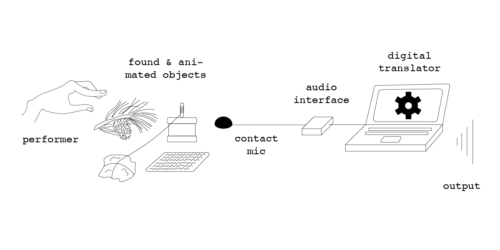
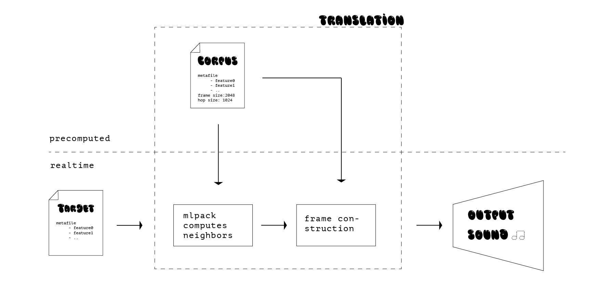

# Final Project for MAT240B
    - Complete source code
    - Resources (i.e., data, images, sounds, etc.)
    - Prominent markings of software and Creative Commons licenses
    - Documentation explaining how to build, install, and run
    - Complete list of dependencies (software libraries, tools, apps, etc.)
    - Final version of your 3-page project report

## title
in translation

## description
in translation is an attempt to explore the potential progressions from the audio content generated by analog found objects set in motion and a filtering digital system. 

It uses things in movement as live input (e.g. small rocks in rotation, piece of metal, branch of pine tree), as they produce sound through friction and contact against each other. The signal generated is then transmitted over an analog amplifier and recorded by a microphone into the computer. The signal is analyzed, filtered/modified and resynthesized using c++ before being played back by speakers.

I envision this project as a small experiment for myself to understand and establish connections between the analog and digital realms of sound. The aforementioned systems would be exhibited on a table, ordered in a procedural fashion, establishing a chain of sonic events. It could resemble an alchemist setup visually and conceptually.

With this project, I also wish to investigate the potential of analysis/resynthesis as a creative process. Inspired by the work of Javier Villegas in the visual realm, I wish to transfer some of his insights into the audio context. 

## schematics
### installation schematics

### digital concatenative synthesis schematics
